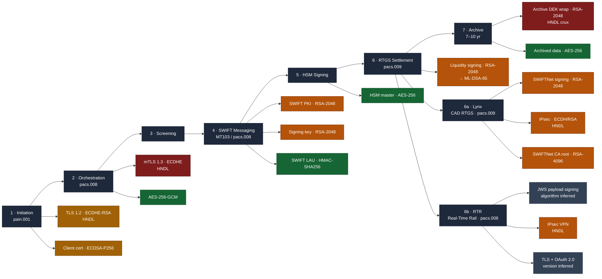

# SWIFT / ISO 20022 Payments Crypto-Dependency Map + CBOM


A machine-readable **Cryptography Bill of Materials (CBOM)** that maps where
quantum-vulnerable cryptography lives across a cross-border wire-payment
lifecycle — `pain.001` initiation → `pacs.008` assembly → sanctions screening →
SWIFT messaging (`MT103` / `pacs.008`) → HSM signing → RTGS settlement
(`pacs.009`) → long-term archive — **extended with two Canadian domestic
settlement rails, Lynx and the Real-Time Rail (RTR)** — and ranks each asset for
post-quantum migration.

Built as a **CycloneDX 1.6** artifact (the spec that upstreamed IBM's CBOM
model) and validated against the official JSON Schema. The payments-domain
reasoning is the point: generic crypto-discovery tools can tell you *that* you
run RSA-2048; they can't tell you it's the signature on a `pacs.009` liquidity
transfer that BIS Project Leap just stress-tested, or that the real
harvest-now-decrypt-later exposure is the RSA key-wrap on your 10-year payment
archive.

**Every asset is evidence-labelled.** A `payments-pqc:confidence` property marks
each one `DOCUMENTED` (stated in a primary source — SWIFT, Payments Canada, BIS,
Cyber Centre) or `INFERRED` (an informed assumption from how the platform
demonstrably works), with a `confidence-note` recording exactly what is known vs
assumed. INFERRED assets — chiefly RTR's signing algorithm and TLS version, which
sit in the participant-only Exchange API spec — are never presented as fact.

> **Reference model, not a real bank.** Every key, certificate, and endpoint is
> illustrative — a representative correspondent-banking estate plus two Canadian
> domestic rails, for demonstration. No production configuration or secret is
> included.

## Why this exists

The regulatory clock on payments cryptography is concrete:

- **NIST** finalised the PQC standards — **FIPS 203 (ML-KEM), 204 (ML-DSA), 205
  (SLH-DSA)** — on 13 Aug 2024, and **NIST IR 8547** sets RSA-2048 / ECC-P-256
  as **deprecated after 2030, disallowed after 2035**.
- **Canada's Cyber Centre (ITSM.40.001)** requires high-priority systems
  migrated by **end-2031**, the rest by **end-2035**.
- **BIS Project Leap Phase 2** (BIS Innovation Hub, Banca d'Italia, Banque de
  France, Deutsche Bundesbank, Nexi-Colt and **SWIFT**) tested PQC signatures in
  the euro **T2 / TARGET2** RTGS system — the report landed **11 Dec 2025**.

The first step in any of these programs is the same: **discover and inventory
your cryptography.** This repo shows what that inventory looks like when it's
done with payments-domain context instead of a generic scanner.

## The map



`P1` critical (HNDL) · `P2` high (signing @ Q-day) · `P3` medium (protocol
hygiene) · `P4` monitor (symmetric/hash). **Dashed** nodes are `INFERRED` (the
platform is documented, the specific algorithm/version is not public). Full
reasoning in [`docs/migration-priorities.md`](docs/migration-priorities.md).

## The analytical payload

**1 — "Quantum-vulnerable" is two buckets, not one.** Confidentiality assets
(key transport / key agreement) are exposed to **harvest-now-decrypt-later** — a
*retroactive* attack, so anything encrypted today with long-lived secrecy is
already at risk (`P1`). Authenticity assets (signatures / certs) are **not**
retroactive — you can't forge a wire that already settled — so their risk
crystallises at Q-day and is driven by deprecation deadlines (`P2`). Collapsing
these into one "fix RSA" bucket is the most common prioritisation mistake.

**2 — The archive key-wrap is the sharpest exposure.** The bulk archive is
AES-256 (safe), but its data-encryption keys are wrapped with **RSA-2048-OAEP**.
A recorded wrapped-DEK today is decryptable post-Q-day, unlocking 7–10 years of
payment records and PII. This asset — not the flashy SWIFT signature — is the
`P1` an analyst should raise first.

**3 — Project Leap says "swap the algorithm" underestimates the work.** At the
ISO 20022 Business Application Header, a Dilithium (Round-3, Level-3) signature
of **3,293 bytes** replaced a **256-byte** RSA-2048 signature — a **~12.9×**
size increase that **overflowed TARGET2's message buffers** and forced
component redevelopment. (Leap tested Dilithium Round 3, not the final ML-DSA,
and used software key files rather than physical HSMs — so production HSM
latency remains an open question.) The lesson baked into this repo: the
deliverable is **crypto-agility**, not a one-time cipher swap. See
[`docs/migration-priorities.md`](docs/migration-priorities.md#project-leap).

**4 — Two Canadian rails, two very different evidence pictures.** **Lynx** (CAD
RTGS) runs over **SWIFTNet**, so it inherits the same documented SWIFT PKI crypto
as the cross-border path — its PQC fate is coupled to **SwiftNet 8.0 (2027)**.
**RTR** (Real-Time Rail) is a modern JSON/REST + IPsec + OAuth stack whose signing
algorithm and TLS version sit in a participant-only spec — so those assets are
modelled **INFERRED** and rendered as such (dashed nodes in the map). Being
greenfield for 2026, RTR is the natural place to build **hybrid-PQC from
inception**. Honest `DOCUMENTED`/`INFERRED` labelling on every asset is what keeps
the artifact credible under expert scrutiny.

## What's in the repo

| Path | What it is |
|---|---|
| [`cbom/payment-estate-cbom.json`](cbom/payment-estate-cbom.json) | The CycloneDX 1.6 CBOM — 31 assets, 23 quantum-vulnerable (26 documented / 5 inferred) |
| [`data/crypto-inventory.yaml`](data/crypto-inventory.yaml) | Human-editable source of truth |
| [`scripts/generate_cbom.py`](scripts/generate_cbom.py) | YAML → CBOM generator (single-source-of-truth design) |
| [`scripts/validate_cbom.py`](scripts/validate_cbom.py) | Structural validation + migration-priority rollup |
| [`docs/crypto-dependency-map.md`](docs/crypto-dependency-map.md) | Stage-by-stage crypto walkthrough |
| [`docs/migration-priorities.md`](docs/migration-priorities.md) | What breaks / can be hybridised + Project Leap analysis |

## Run it

```bash
pip install -r requirements.txt

# regenerate the CBOM from the inventory
python scripts/generate_cbom.py --inventory data/crypto-inventory.yaml --out cbom/payment-estate-cbom.json

# structural validation + risk rollup
python scripts/validate_cbom.py cbom/payment-estate-cbom.json
```

```
Assets: 31   Quantum-vulnerable: 23 (74%)

Migration-priority rollup
  P1-CRITICAL    4
  P2-HIGH        12
  P3-MEDIUM      7
  P4-MONITOR     5
  TARGET         3

Evidence-confidence rollup
  DOCUMENTED     26
  INFERRED       5
```

CI ([`.github/workflows/validate.yml`](.github/workflows/validate.yml))
runs `generate_cbom.py --check` on every push and **fails if the committed JSON
is out of sync with the inventory** — the artifact can never silently diverge,
and because generation is deterministic the check is byte-reproducible.

## Design choices worth noting

- **The CBOM is a build artifact, never hand-edited.** One authoritative
  register (the YAML) → machine-generated evidence. That *is* crypto-agility:
  change a target algorithm in one place, regenerate, re-attest.
- **Payments reasoning rides in namespaced `properties`** (`payments-pqc:…`) so
  the file stays valid CycloneDX and ingests cleanly into any standard tool
  (CBOMkit, dependency-track, etc.) while carrying the domain context those
  tools don't have.
- **Validated against the official CycloneDX 1.6 JSON Schema** — which, during
  development, correctly caught a field (`algorithmFamily`) that only exists in
  the 1.7 registry. Provenance matters more than plausibility.

## Standards & references

- CycloneDX 1.6 CBOM — https://cyclonedx.org/capabilities/cbom/
- NIST FIPS 203 / 204 / 205 (2024); NIST IR 8547 (transition guidance)
- Canadian Centre for Cyber Security ITSM.40.001
- BIS *Project Leap phase 2* (othp107), 11 Dec 2025 — https://www.bis.org/publ/othp107.htm

## Limitations

This is a **demonstration reference model**, not production security tooling. The
estate is representative, not any real institution's. Target-algorithm mappings
(ML-KEM-768, ML-DSA-65) reflect a reasonable default posture, not a
one-size-fits-all recommendation — parameter-set selection is a per-system risk
decision. All third-party figures (Project Leap, NIST/Cyber Centre deadlines)
should be verified against the cited primary sources before reuse.
