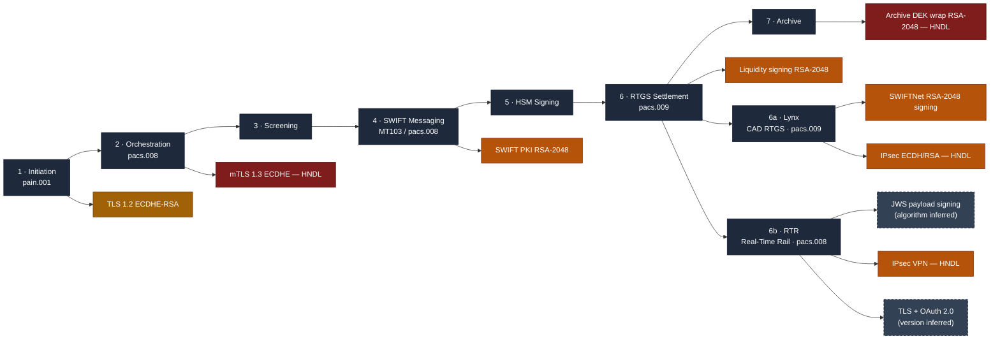

# Cryptographic Dependency Map — Wire-Payment Lifecycle

Where quantum-vulnerable cryptography lives across a cross-border wire, stage by
stage. This is the human-readable companion to
[`cbom/payment-estate-cbom.json`](../cbom/payment-estate-cbom.json); every row
below corresponds to a `cryptographic-asset` component in the CBOM.

Dashed nodes are **INFERRED** — the underlying platform is documented, but the
system-specific algorithm/version is not public (gated in the participant-only
RTR Exchange API spec). Every asset in the CBOM carries a `payments-pqc:confidence`
label (`DOCUMENTED` / `INFERRED`) and a `confidence-note`.

## Stage-by-stage

### 1 · Payment initiation (`pain.001`)
The corporate treasury submits a payment instruction over a host-to-host or API
channel. Crypto in play: **TLS 1.2** (legacy corporate channel, `ECDHE-RSA`) and
a **corporate client certificate** (`ECDSA-P256`) for mutual authentication.
Quantum exposure: the ECDHE key exchange is **harvest-now-decrypt-later (HNDL)**
exposed; the client cert is forgeable once a CRQC exists.

### 2 · Orchestration & `pacs.008` assembly
The payment engine translates the instruction into an ISO 20022 `pacs.008` and
moves it across internal microservices over **mTLS 1.3**. Payment data is written
to disk under **AES-256-GCM** (TDE). Quantum exposure: the TLS 1.3 key
establishment is still ECDHE-based → **HNDL**. The AES-256 at-rest layer is safe.

### 3 · Sanctions / AML screening
The message is screened against watchlists via an internal or vendor service over
**mTLS 1.3** — same HNDL consideration as stage 2.

### 4 · SWIFT messaging (`MT103` / `pacs.008`)
The message is signed and dispatched over SWIFTNet (FIN `MT103` or InterAct
`pacs.008`). Crypto in play: the **SWIFT PKI end-entity certificate**
(`RSA-2048`), the **message-signing key** (`RSA-2048`), and **SWIFT Local
Authentication (LAU)** integrity (`HMAC-SHA-256`) between the back-office app and
the messaging interface. Quantum exposure: RSA signing is forgeable at Q-day;
HMAC-SHA-256 is safe.

### 5 · HSM signing
Signing operations execute inside an **HSM (FIPS 140-2 Level 3)**. The signing
private key is `RSA-2048`; the HSM master wrapping key is `AES-256`. Quantum
exposure: the RSA signing key is the asset that must migrate; the AES master key
is safe.

### 6 · RTGS settlement (`pacs.009`)
Liquidity / settlement instructions are signed and sent to the RTGS system. This
is the **exact touchpoint BIS Project Leap Phase 2 tested** — replacing the RSA
signature on liquidity transfers with a lattice signature. See
[migration-priorities.md](./migration-priorities.md#project-leap).

### 7 · Archive (7–10 yr retention)
Payment records and PII are retained for years under **AES-256-GCM**, with the
data-encryption keys **wrapped by `RSA-2048-OAEP`**. Quantum exposure: the bulk
AES is safe, but the RSA key-wrap is the single clearest **HNDL** exposure in the
estate — an adversary who records a wrapped DEK today can recover it once a CRQC
exists, then decrypt everything under it. **This is the highest-urgency asset.**

## Canadian domestic settlement endpoints

The estate above is the cross-border SWIFT path. A Canadian bank also settles
domestically over two Payments Canada rails, added here as endpoints branching
off settlement. Each asset is labelled `DOCUMENTED` or `INFERRED`.

### 6a · Lynx — CAD high-value RTGS (`pacs.009`)
Lynx (live 30 Aug 2021, Payments Canada, replaced LVTS) is **ISO 20022-native and
runs its message exchange over SWIFTNet InterAct**. Cryptographically it is a
Canadian instance of the same SWIFT PKI stack already in this estate: **RSA-2048**
message signing in **FIPS 140-2 Level 3 SWIFT HSMs**, a **RSA-4096 SWIFTNet PKI CA
root**, **IPsec (SWIFT Alliance Connect)** transport with AES-256 bulk and RSA/ECDH
authentication, and SHA-256 hashing. Confidence: the SWIFT-platform crypto is
**DOCUMENTED** (SWIFT security docs; Lynx TSP-005 confirms signature verification);
that a given Lynx participant uses the standard SWIFTNet business certificate is a
platform-derived inference. Quantum exposure mirrors the cross-border path — and
Lynx's PQC fate is effectively **coupled to SWIFT's SwiftNet 8.0 (2027) PQC
timeline**.

### 6b · RTR — Real-Time Rail (`pacs.008`, ISO 20022 / JSON)
The Real-Time Rail (Payments Canada; exchange by Interac, clearing & settlement by
Mastercard/Vocalink; expected launch 2026) is **ISO 20022-native over JSON/REST
APIs** — a different, modern stack from SWIFTNet. The RTR Participation Guide
(Oct 2025) documents that payloads **"must be encrypted, digitally signed and
validated"**, run over an **IPsec site-to-site VPN**, use **TLS/HTTPS** portals,
**OAuth 2.0** and **IDAM** tokens, **SFTP/SSH** public-key reporting, and mandatory
MFA — but the **specific signing algorithm (JWS RS256/ES256), TLS version, and HSM
custody are NOT public**; they are gated in the participant-only RTR Exchange API
spec and are modelled here as **INFERRED**. Note the in-message ISO 20022
`<Signature>` element is optional and *not validated* by RTR — signing is enforced
at the API/payload layer. Because RTR is greenfield and launching well before the
2031 deadline, it is the natural candidate for **crypto-agility / hybrid-PQC design
from inception**.

## Why signatures and key-establishment carry different urgency

A recurring analyst error is treating "quantum-vulnerable" as one bucket. It is
two:

- **Confidentiality assets (key transport / key agreement).** Vulnerable to
  **harvest-now-decrypt-later**: the attack is *retroactive*. Anything encrypted
  today whose secrecy must survive past Q-day is already at risk. → `P1`.
- **Authenticity assets (signatures / certificates).** Not retroactive — you
  cannot forge a 2026 wire after the fact; it already settled. The risk
  crystallises *at* Q-day and is driven by regulatory deprecation deadlines
  (RSA/ECDSA deprecated after 2030, disallowed after 2035). → `P2`.

This distinction is the backbone of the prioritisation in the CBOM.
